# Project Management, git, and GitHub

This section is going to introduce us to to major pieces of the puzzle for building a webpage. These skills are also incredibly relevant to working in R more generally, so if you can understand these components and how they relate, you're well on your way to have streamlined management practices in R. We are going to talk about 1) R Projects, 2) git, and 3) GitHub.  

## Organizing RStudio with projects  

Here we are just going to get set up with an R Project that will be a strong base for _any_ kind of research project, website building included. This set up will be exclusive to your desktop -- no need to involve GitHub here if you don't want.  

### Where am I? Getting to know your file paths 

One of the first things useful to know when you open up RStudio is: **where am I in my computer?** You get answer this by running the `getwd()` function to find your _working directory_, like this:

```{r, eval = F}
getwd()
```

A working directory is where your RStudio session is operating from (i.e. its home base) at that moment. The answer to `getwd()` will be unique to your computer, and might vary quite greatly for folks who are not in an R Project (more on that soon). If you are not in an R Project, you can set your default working directory under **Tools > Global Options**. This is then the very first default that you can set.  

```{r , echo=FALSE, out.width = '70%', fig.align='center'}
knitr::include_graphics("imgs/default_dir.png")
```

Before we get into projects, we want to make sure we understand how to navigate around our computer using **file paths**. File paths are the sequence of folders (also called directories) that tell your computer where to find a certain file. So when you open a finder and click through different folder images or names to find and end destination, you are navigating along a particular file path. When we code, instead of clicking we want to guide R into the right directory using the path name.

There are 2 basic kinds of file paths:

* Absolute: Absolute paths list out the full file path, usually starting with your username, which you can also refer to using the shortcut ~. So instead of `C:/MyName/Documents` or `/Users/MyName/Documents`, you can type `~/Documents`. But generally, the only place an absolute path will work is your computer. It will break on anyone else computer, or anytime you move or rename something.  
* Relative: Relative paths are relative to your _working directory_. So if R thinks we’re in that `~/MyName/Documents/Projects/2023` folder, and we want to access a file in a folder inside it called `data`, we can type `data/my_file` instead of `~MyName/Documents/Projects/2023/data`.  

**Check in**  

It can be fun to experiment a little with file paths to understand where you are. First, any time you open up quotation marks, R might think you are prompting it with a file path. So if you open up quotation marks and put your cursor inside, it will prompt you with the next files in line, relative to your working directory. 

```{r , echo=FALSE, out.width = '70%', fig.align='center'}
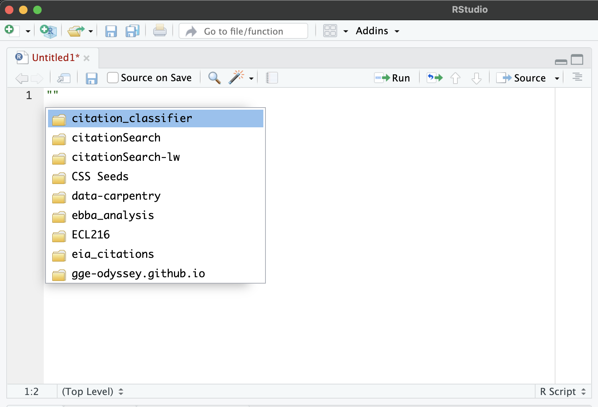
```

Fun note is that you can continue to move deeper and deeper into a file path with the help of tab completion. And you can also move _back out_ of a file path with two periods `../`. This signals to your computer that you want to back up instead of move forward along your file path, then you can choose to take another road

```{r , echo=FALSE, out.width = '70%', fig.align='center'}
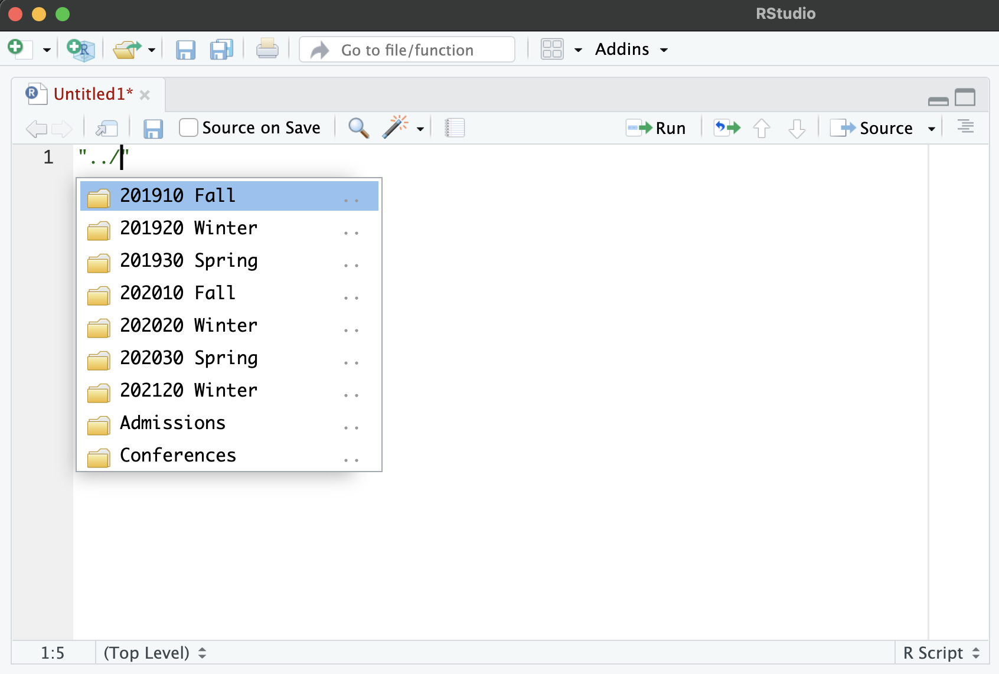
```

### "File paths feel complicated" [Enter R projects]

One of the great advantages of using tools like RStudio is they make it easy to use an organized 'project' workflow. What do we mean by 'using projects'? Projects refer to a general pattern or structure used for each work project or analysis. This approach is not specific to R. Any practiced data scientist will use a folder structure and organization scheme, no matter what programming language they use. We'll get to that in a minute.

What is special in RStudio is that projects also positions your working directory in a folder, which you can then use as your home base to organize the project folders around. Let's make a project and organize folders around it. 

To start a new project, we want to follow the **File > New Project** option in RStudio. We're going to start by selecting the **New Directory** option.  

```{r , echo=FALSE, out.width = '70%', fig.align = 'center', fig.pos = 'hold'}
#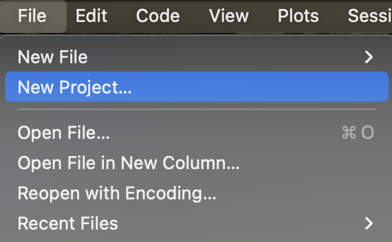
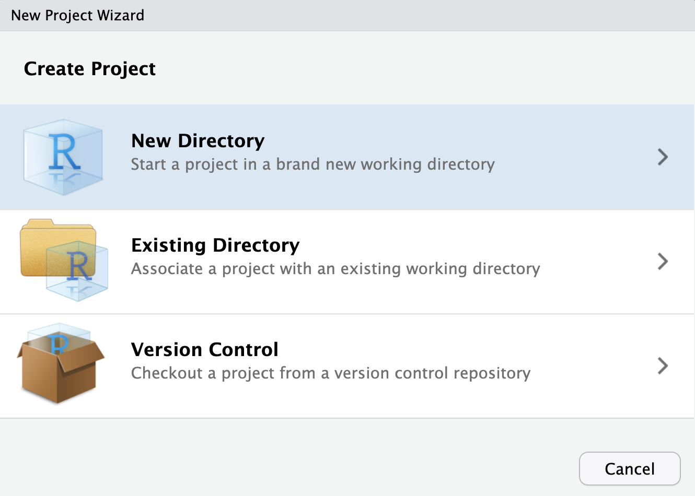
```

Next, we're going to select the **New Project** option. Take a look around before you do to notice how many different options there are! All sorts of templates! These can be great places to start for all sorts of activities -- building a web page, a Shiny App, etc. But for now we are going to start without any bells and whistles.  

```{r , echo=FALSE, out.width = '70%', fig.align = 'center', fig.pos = 'hold'}
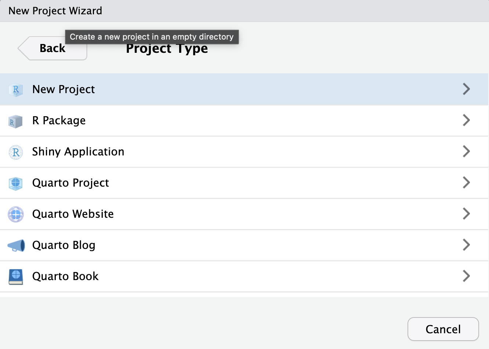
```

Once in that new project, we need to give the directory (folder) a name. For the sake of this workshop, we are going to give our project directory the same name as what will eventually be our web page repository. In most cases what you name the directory doesn't matter, but here we will try to be exact. Name the repository your-github-username.github.io. So for example, my github user name is liza-instructor, so my directory will be called liza-instructor.github.io.

```{r , echo=FALSE, out.width = '70%', fig.align = 'center', fig.pos = 'hold'}
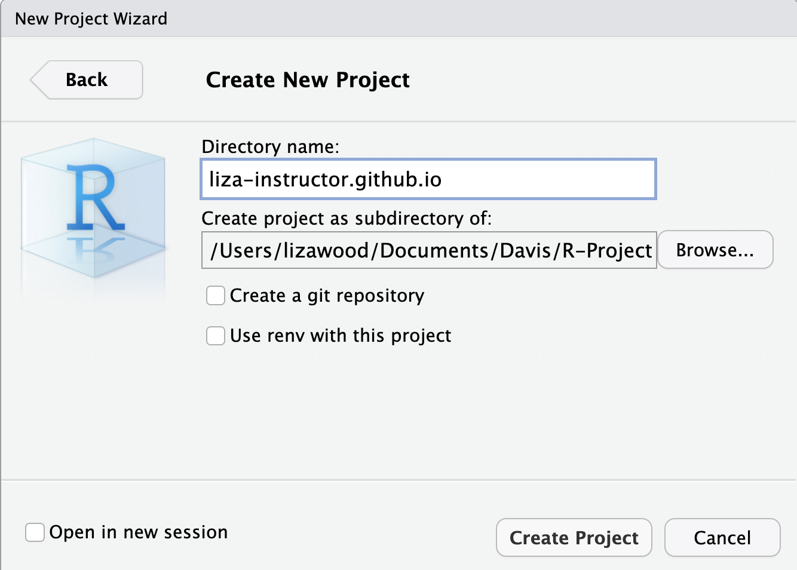
```

Now, in the R Project, we can again ask R to report our working directory with `getwd()`. This time, your answer should be different. If set up correctly, your working directory should not be the folder created by the project. What this means is that everything you do inside this project (i.e. you open this project when you open your R session) will be _relative_ to your project working directory. This is powerful because now all of the file paths you use will be relative.

When setting up a project, the general idea is to always use the same structure and naming schemes across every project. For a research project, you should typically have a couple files and folders, including README.md, script, figures, and maybe data, depending on your data storage needs. For a web page, we're going to do something a little different.  

For now, we should all create/save a script called 'workshop_notes.R'. This can be saved in our website repository, even though it won't be part of our webpage, eventually. But it can be a useful place for us to store notes and experiment.  

## git as local version control  

Next, we're going to review how git works. It is important to recognize that git is a software on its own that doesn't need GitHub to operate as version control. You can use git on different projects without ever connecting to GitHub, just to monitor your work 'locally' (on your computer).

Now, if you looked closely when you were setting up your project, there was an option to check the box saying: Create a git repository. That would accomplish what we're about to do. But instead of just checking the box, we are going to dig in deep by using **git in the Terminal** in order to really understand what git is and how to use it.

So, **tab over to the Terminal in RStudio**, which should be next to your Console tab

```{r , echo=FALSE, out.width = '70%', fig.align='center'}
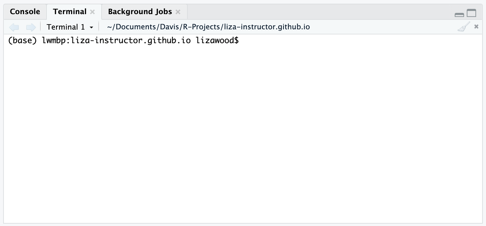
```

You want to make sure to see two things. First, is there a dollar sign ($) starting your prompt? Second, is the project name somewhere in your prompt? For example, my prompt reads: `(base) lwmbp:liza-instructor.github.io lizawood\$`. This is the name of my computer (lwmbp), the name of my project (liza-instructor.github.io) and my username (lizawood). If that isn't happening for you, check your your **Tools > Global options > Terminal** and take a look at the first two settings. Your 'Initial directory' should be set to 'Project directory' and 'New terminal open with' should be 'Bash' for Macs or 'Git Bash' for Windows.  

```{r , echo=FALSE, out.width = '70%', fig.align='center'}
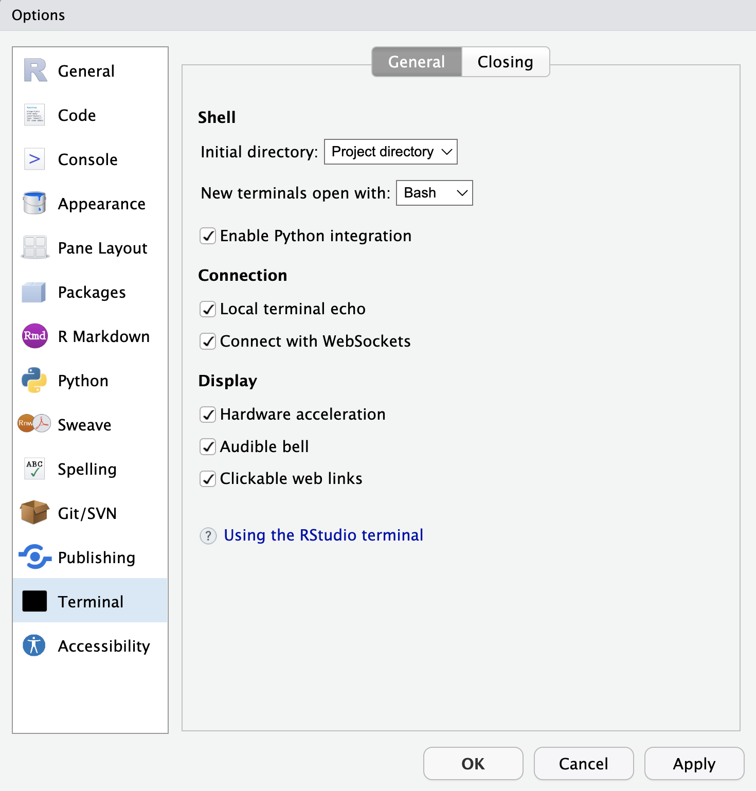
```

If you're all set in Terminal, not we want to initiate git! What this means is that we want the git software to begin tracking the changes made within this project folder (and the subfolders we will eventually store in the project folder). We initialize git by typing the following command, `git init` in Terminal and pressing Enter.  

```
git init
```

You should get a message with several details, as  along these lines: 

```
hint: Using 'master' as the name for the initial branch. This default branch name
hint: is subject to change. To configure the initial branch name to use in all
hint: of your new repositories, which will suppress this warning, call:
hint: 
hint: 	git config --global init.defaultBranch <name>
hint: 
hint: Names commonly chosen instead of 'master' are 'main', 'trunk' and
hint: 'development'. The just-created branch can be renamed via this command:
hint: 
hint: 	git branch -m <name>
Initialized empty Git repository in
/Users/lizawood/Documents/R-Projects/liza-instructor.github.io/.git/
```

We will focus right now on the bottom-most line: You've initialized a repository!

So, now let's talk about what git does. Let's save our workshop_notes.R script then ask git what it is up to with the following commands in Terminal:

```
git status
```

What do we get?

```
(base) lwmbp:liza-instructor.github.io lizawood$ git status
On branch main
Your branch is up to date with 'origin/main'.

Untracked files:
  (use "git add <file>..." to include in what will be committed)
        .Rproj.user/
        liza-instructor.github.io.Rproj
        workshop_notes.R

no changes added to commit (use "git add" and/or "git commit -a")
```

This report is telling us that we have untracked files. Meaning -- git has not yet 'tracked' or recorded the files we have in our Project. Namely, the workshop_notes.R looks familiar. But what is that other stuff? We really don't want to concern ourselves with this much, because this is just session information about our users. But instead of just mentally ignoring it, we can actually tell git to ignore it using a .gitignore file. 

Open a plain text file, and then inside that text file you can name the types of things you want git to ignore. In our case, this is '.Rproj.user'. Note that you can use this ignore file for all sorts of things. If you have some secret code you're not ready to share, or a big data folder that won't fit on git. This is one way to keep parts of your project 'hidden' from git. But for now we are just going to use it to keep out unwanted clutter that goes on in R's background. If you get a warning about saving, go ahead and do it anyways.  

```{r , echo=FALSE, out.width = '49%', fig.pos = 'hold'}
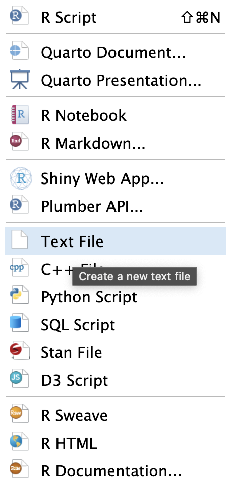
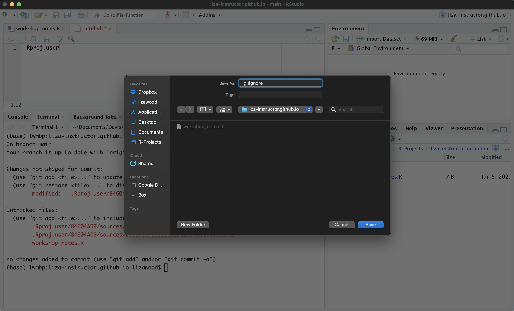
```

Now, we can ask Terminal for the git status again, we see what's changed:

```
(base) lwmbp:liza-instructor.github.io lizawood$ git status
On branch main
Your branch is up to date with 'origin/main'.

Untracked files:
  (use "git add <file>..." to include in what will be committed)
        .gitignore
        liza-instructor.github.io.Rproj
        workshop_notes.R

no changes added to commit (use "git add" and/or "git commit -a")
```

Now it is tracking our gitignore file but nor our Project user info.  

So, now we can get into action. We want to use git to track our edits on RStudio. To get git to do that, we need to do two steps: 1) "Stage" files for tracking by "adding" them, and 2) "Committing" files to git's version control memory. We are going to do this with two main git commits. 


First, we want to 'stage' for commit with the `git add` command in Terminal. But we need to specify what to add. You can add file by file by including their name. For instance, we can try:

```
git add workshop_notes.R
```

Then when we check our git status, we see something new. Now workshop_notes.R has moved to a new category: Changes to be committed, while .gitignore is still in the Untracked files. 

```
(base) lwmbp:liza-instructor.github.io lizawood$ git status
On branch main
Your branch is up to date with 'origin/main'.

Changes to be committed:
  (use "git restore --staged <file>..." to unstage)
        new file:   workshop_notes.R

Untracked files:
  (use "git add <file>..." to include in what will be committed)
        .gitignore
        liza-instructor.github.io.Rproj
```

More often than not, I want to add all of my untracked files at once. So instead of listing them out one by one, we can use file path speak for "take them all", which is the period (.). 

```
git add .
```

Now we have added all untracked files. You can check git status again to verify.

Next, we want to complete step two: commit the tracked changes. We will do this with the `git commit` command in Terminal. But we also need to include a message when we commit, which will be associated with the commit. To do this we need to append the `-m` flag to the command, and write the message in quotations. Like this:

```
git commit -m 'first commit'
```

When you commit, all sorts of data will be attached. The files, the time, the edits. So messages are (ideally) sharing information about the changes or activity that is not already reflected by the files the message is associated with or the time of the commit.  

What this commit does is essentially puts a pin in your work. It saves a version of that work to the git version control software -- you'll see when you commit that you'll get a short summary and an 'id' number associated with that commit. This version of your work is not stored in git. Woo hoo!

### Check in  

We did this in a drawn out way, but the key take-aways are that you should be adding and committing on a regular basis. I generally like to add and commit work at the end of the day, but if I am working on a project where I am adding and deleting and trialing several ideas, I will add and commit before I delete or trial something major. All the git status and .gitignore things aside, you'll mainly want to remember the two steps: `git add .` and `git commit -m 'write a message'`. Make a change to your 'workshop_notes.R' file, save it, and go through these two steps:

```
git add .
git commit -m 'updating notes'
```

Now we can use another command in the Terminal, `git log --oneline` to see a one line report out of the activity that has taken place.  

## Connecting remotely to GitHub  

Now, we have a project set up so we have a good home base for our working directory. We're set up with git so that it is tracking our every move. Now, we want to connect this workflow to the internet. If you were working on a research project, this connection would be to serve as a cloud backup, potentially a public-facing demonstration of your work, and open up possibilities for code collaboration. With the project we're going to make today, connecting to GitHub will allow us to not only have public-facing work, but have the work be hosted on a site that we create. 

It is worth taking a moment to take stock of a nice good image that helps us understand git, and its relationship to GitHub. So far we have done the lower, 'local' part of this image. We've set up a local working directory via our R Project, then connected that to a local 'repository', which is how git houses the versions we make, which are intimately linked to your project. We have staged and committed changed to the local repository. And now we want to push and pull up to a a remote (internet) repository. 

```{r , echo=FALSE, out.width = '70%', fig.align='center'}
knitr::include_graphics("imgs/git_workflow.png")
```

### Create a remote repository

To create a remote repository on GitHub, we will need to navigate to our GitHub profiles, and make it to your repositories tab. 

```{r , echo=FALSE, out.width = '40%', fig.align='center'}
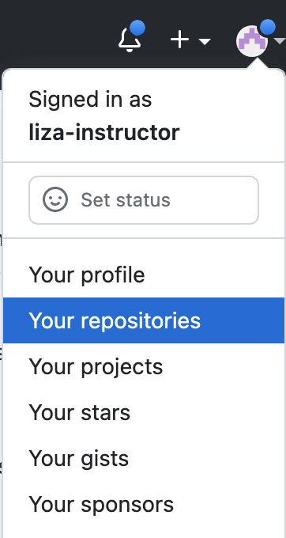
```

Once on that page, select the green button on the right of the screen that signals you want to make a new repository. 

```{r , echo=FALSE, out.width = '70%', fig.align = 'center'}
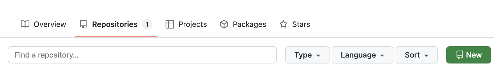
```

Now, you get to name your repository! If you were doing a research project, this could describe that project. Typically, I make repositories and R Projects with the same name, and only have one project per repository. For the website, the name of the repository is really important because it influences how GitHub will _host_ the site. So follow the exact format for your repository name: <github-username>.github.io. So for instance, mine is 'liza-instructor.github.gio'. It looks redundant, but please do it. 

```{r , echo=FALSE, out.width = '70%', fig.align='center'}
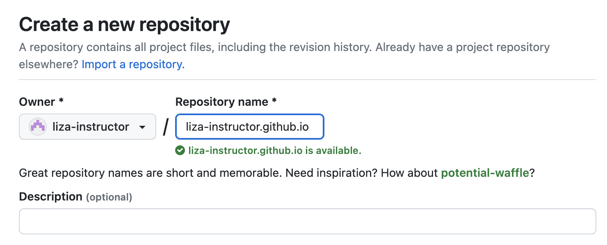
```

For now we will leave all the other settings blank, since we are going to connect to our existing repository that we have already initiated locally. Click 'Create repository' at the bottom, and you should be taken to a set-up page. GitHub provides several instruction for set-up. We are going to follow the option '...or push an existing reppository from the command line' because we have already created our local repository. We don't need to initiate a new one. 
We are going to follow those instructions in the command line (Terminal).

```{r , echo=FALSE, out.width = '100%', fig.align='center'}
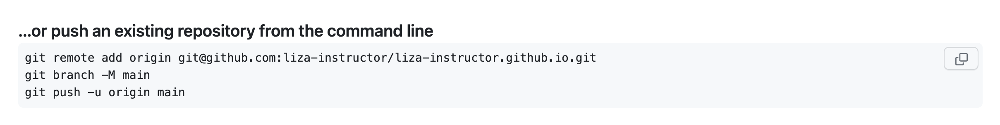
```

These instructions walk you through three steps, two of which you won't need to do again.   
1. In the first line `git remote add origin` you are creating a tether between your local repository ('repo') and the remote repo on GitHub. Once you've add the remote origin link to your local repo, you don't need to do it again.  

2. Second, `git branch -M main`, we are specifying the name of our main branch. We won't get into branching for this workshop, but know that one of the several functionalities of git and collaborating on GitHub are branches. If you think of a project as a tree, you can create a branch to work on something 'on the side' to experiment. Once it is done, you can merge that branch into the main branch... this is largely for collaborative purposes. So for now, you've establshied that your git branch main `git branch -M` is called 'main'.  

3. Last, you have told git to 'push' your commited changes up to GitHub. This is the command that links your local repository to the remote repository. It know where to go because of step 1 -- you've given it the URL to your project on the internet, essentially. You've also been very specific about whether what branch you are pushing to 'upstream' `-u origin main`. From now on, if you aren't working with branches, you only need to `git push` -- no need to specify the origina of the branch.  

There's a lot going on here, but you can reference a little git cheat sheet by just typing the command `git` into the Terminal. You will be provided with several git commands and 'flags' (what those dash and letters mean).

#### Check in

So what have we done?  

1. Started a project in RStudio.  

2. Initialized a local git repository with in that project folder using the `git init` command in Terminal.  

3. Created a remote GitHub repository and then linked the local and remote repositories in Terminal.  

** Check your GitHub webpage to see the updates have been pushed in real time**. If they have, you're all set.Now within our project, we can save and updates files, and as we do, follow the three key steps to keep our local and remote repositories tracking our work and in sync with one another:

```
git add .
git commit -m 'message'
git push
```

I'm generally finishing my day with these steps to keep a log of my work. 

### Do it all in reverse

Once you understand each of the steps we walked through in the previous sections, it is important to understand that you can mix up that order of operations. In fact, it is quite common for folks to do it all in reverse: 

1. Create a remote repository in GitHub.  

2. 'Clone' that to a local repository while simultaneously generating an R Project in RStudio.  

What does that look like? We can provide a little glimpse with a practice repository. First, you'll want to start a new repo in GitHub. When you do this, you can now create certain settings, like adding a README and adding a .gitignore file that is templated for RStudio, so that those items exist right from the start.

```{r , echo=FALSE, out.width = '70%', fig.align='center'}
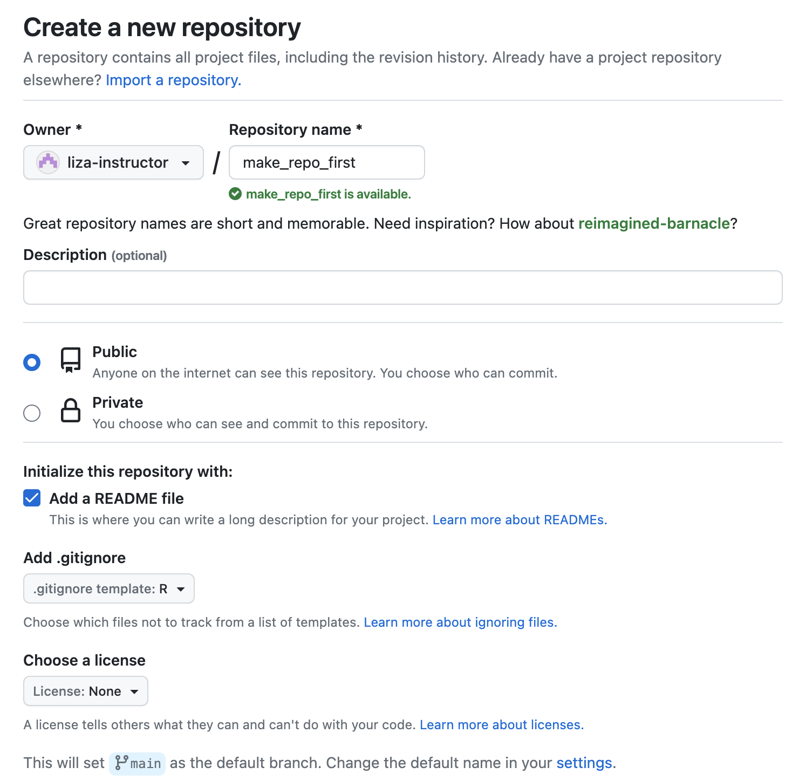
```

Once we've created that repository, you'll want to follow the green 'Code' button to the right of the options on the repo. When you open that, you should copy the SSH URL to use when you create a new project

```{r , echo=FALSE, out.width = '70%', fig.align='center'}
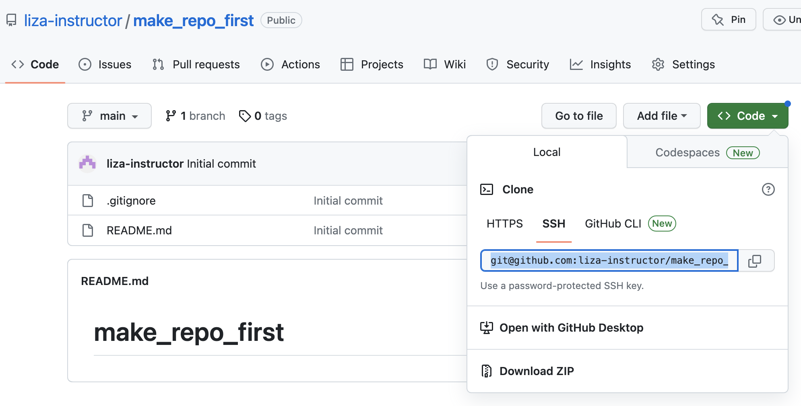
```

Then in RStudio, we can **File > New Project** but this time we will follow the **Version Control** path and select the **Git** option. You'll then be prompted to paste in a Repository URL. This is where you paste in the SSH URL copied from GitHub. In some cases, the directory name automatically fills in with the repo name from GitHub. In other settings, you may need to type it. This will be the name of your projects' directory. Last, you just have to click Create Project, and your repository from GitHub will be 'cloned' as a local repository, and the tether will be established so you can add, commit, and push all you want!

```{r, echo = F, out.width = '49%', fig.pos='hold'}
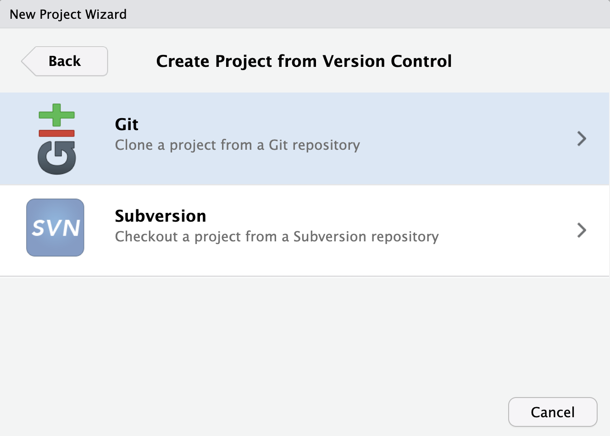
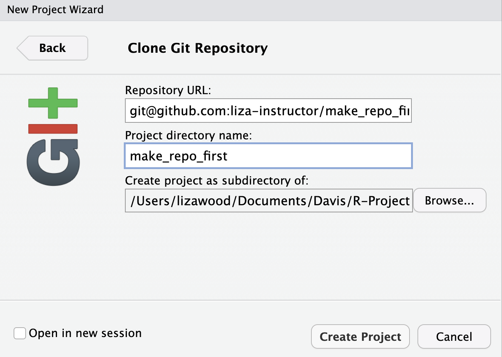
```

<!---
## Why did I do this?

**Project management**

**Version control**

**Collaboration**

**Hosting websites**
--->