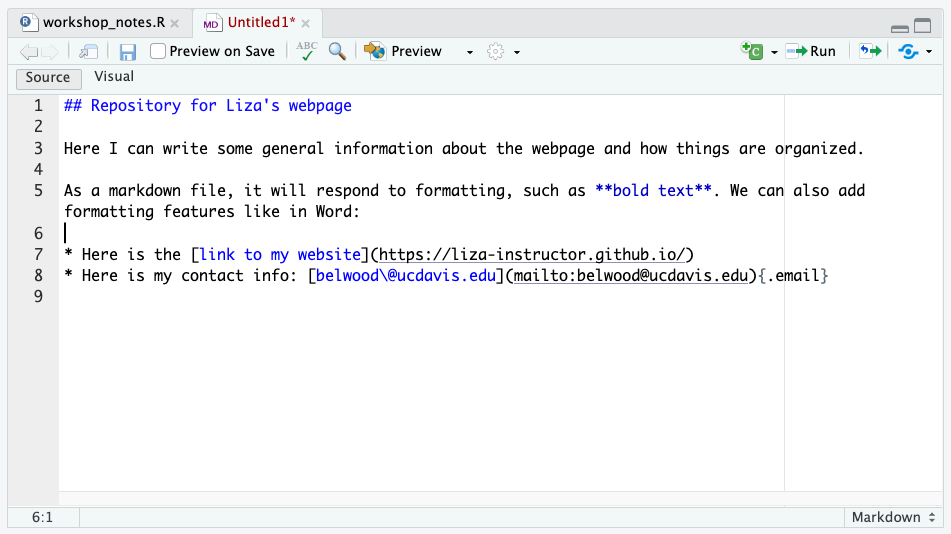
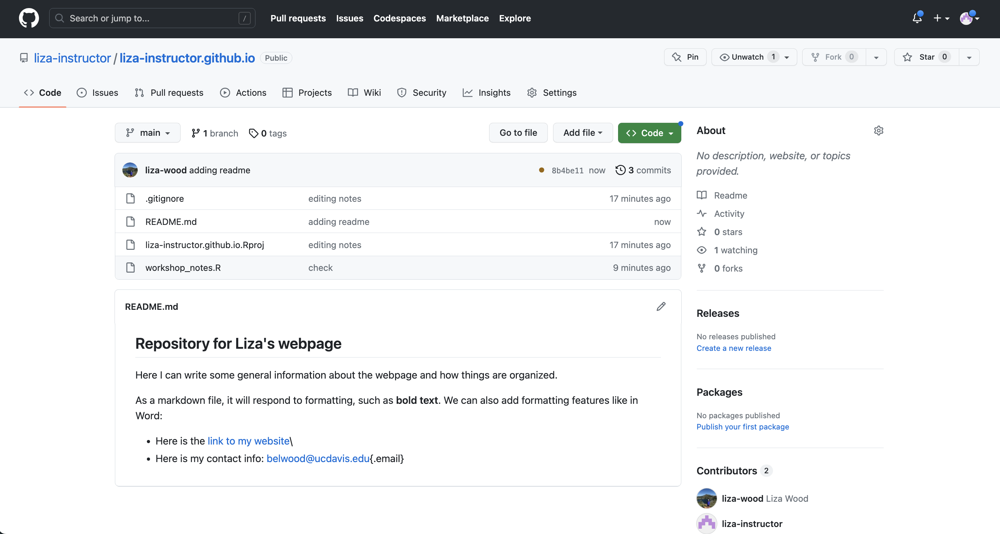
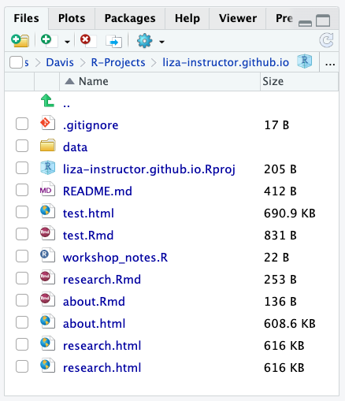

# Rmd  

This section is going to introduce us to to RMarkdown, the file type we'll be using for each 'page' of our webpage. RMarkdown is a great tool beyond webpages, as it allows you to generate integrated text and code reports in different formats, usually HTML for web viewing or PDFs. In the following sections we'll introduce 1) Markdown and 2) Combining markdown with R for RMarkdown.  

## Markdown  

Markdown is a 'markup' language to add formatting elements to plain text documents. This means that we can add format to documents we are creating by knowing the right codes. 

One of the most common kinds of basic markdown files are README files. In R and GitHub, you are encouraged to create a README document to record relevant information (or metadata) about a certain R project/Git Repository. For our webpage repository, we should only have the notes R script that we're working on. Let's make a README markdown.

Open up a blank markdown file by following: **File > New File > Markdown File**. Inside this markdown file we can write up a brief summary of this repository and practice some of the markdown skills. There are several [markdown cheat sheets](https://github.com/adam-p/markdown-here/wiki/Markdown-Cheatsheet) out there that you can search to wrap your head around the basics of the language. 

Though admittedly, RStudio updates recently have been getting so fancy that you hardly need to learn markdown anymore. If you toggle over the 'Visual' pane, you can see and edit the document as you would a Word document. Toggle back over to the Source viewer and you'll see how the markdown language was embedded. 

```{r, echo = F, out.width = '49%', fig.pos='hold'}

knitr::include_graphics("imgs/readme_visual.png")
```

Let's save this file with the name README.md. GitHub knows to look for markdown files with this name, and when it sees them, it knows to publish them as your repository's splash page. Once you **save your README.md** practice our pushing steps up to GitHub:

```
git add README.md
git commit -m 'adding README'
git push
```

You should see the changes reflected on your GitHub webpage:

```{r, echo = F, fig.align = 'center'}

```


## Markdown + R = RMarkdown (or Rmd)

RMarkdown files, which will be the focus of what we work with today, are Markdown files in which you can embed R code (and other languages too!). Let's open up a file and see how this works: **File > New File > R Markdown**. 

For now, let's just give this file the title 'Test' and click Okay to open up an HTML version of Rmd. Remember we said that Rmds can 'render' in many formats, such as PDF, Word, as Shiny Apps and/or Beamer presentations. We'll stick with the default HTML just to introduce ourselves to Rmd and walk through some of its basic components.

### Mixing markdown text and code 

The template provided by the Rmd document gives an examples of how to embed text and code. There are two text sections, indicated using the pound sign (#), and some text that has some formatting like bolding and embedding links. There are also 2 code 'chunks' opened by three back ticks, curly brackets, the letter r, then closed out by three back ticks. You can create a new code chunk by selecting the green C icon in the top right of your Rmd or with the key combination: Cmd/Ctrl + Alt/Opt + i.  

Within each chunk, you can insert code, as well as optional 'chunk options'. A cheat with these chunk options, and more Rmd hints, is [here](https://www.rstudio.com/wp-content/uploads/2015/02/rmarkdown-cheatsheet.pdf). You can insert chunk options as follows: 

```
\```{r chunk name, echo = F, fig.align = "center", warnings = F}
summary(cars)
\```
```

Let's go ahead and click the 'Knit' icon to 'render' this document to see what our out looks like, and then we can discuss some of the added features that help knitting happen. 

```{r, echo = F, fig.align = 'center'}
knitr::include_graphics("imgs/rmd_hp.png")
```

### The YAML   

```
---
title: "Test"
author: "Liza Wood"
date: "2023-06-16"
output: html_document
---
```

YAMLs are part of the guiding architecture for your Rmd file, located at the very top, indicated by three dashes to begin and end, and it can contain a series of information bits about the markdown document in between. Most important for us is the output, which tells R the format to 'render' the document. (As it turns out, YAML means either 'yet another markup language' or 'YAML ain't a markup language', which seems to involved a series of computer programmer jokes that I am not advanced enough to know the history behind).  

Beyond the basics that typically start in this default, what goes in a YAML also depends on the kind of output you have. We'll just flag this here, because the **yaml will become an important feature of the webpage.** Here is a nice ['field guide' for YAMLS](https://cran.r-project.org/web/packages/ymlthis/vignettes/yaml-fieldguide.html), and it is worth noting that knitting to a PDF may require installations and management of [LaTeX on your computer](https://bookdown.org/yihui/rmarkdown-cookbook/install-latex.html), which we don't do today. 

### Setup chunk 

The next thing I want to call attention to is the setup chunk. The Rmd template inserts this to flag good practice when setting up an Rmd. Here are two kinds of options that you can set for _all_ of your chunks with the `knitr` package. The one displayed in the default is for **default chunk options**. So things like: do you always want echo to be T, figures to be centered, etc. You can include all of these defaults here, and still override them in individual chunks if need be. So for example: 

```
\```{r chunk setup, include=FALSE}
knitr::opts_chunk$set(echo = TRUE, fig.align = 'center', warning = FALSE)
\```
```

The second kind of default you can set up, which becomes important when you start trying to read in data from other sources, is the **default knit options**. My default, because we've set up an **RProject**, your working directory should be the project directory. So this step may be unnecessary. But if you find yourself not being in the right place, or wanting to source data from elsewhere, you can set the working directory for every chunk with the following code: 

```
\```{r knit setup, include=FALSE}
knitr::opts_knit$set(root.dir = 'path/to/desired/wd')
\```
```

## Let's make some webpage Rmds

We are going to practice working with R Markdown files by drafting up two pages of our website. Let's try to make an "About" page and a "Research" page, just for practice. Here's some guidance.  

### Make an 'About' page  

First, let's open a new R Markdown file, title it "About", and importantly, let's save it right away with the name 'about.Rmd'. **The names that we assign to our markdown files will be important for our website index shortly**. Let's use this page primarily as a space for practicing Markdown (i.e. maybe don't use code here). Write up a brief summary profile, and you may want to use some formatting features. You can do this in Markdown yourself or toggle over to the Visual option and use those features.  

Some of the things you may want to do include:  

* Linking content. You can link content in text by...  
* Embedding images. This can be done one of several ways. If the photo is already hosted somewhere online, you can embed it as a link (see cheat sheet). If it is a document on your computer, you can create a new folder in your project, called something like 'img', and add in photos to this folder. Once you do that, you can source this image either 'inline' with markdown, with the following code right in your text area (), or as part of a chunk, demomtrsated below. Note that playing around with sizing and location will take some searching online. This is the time to start experimenting!  

```
\```{r}
knitr::include_graphics("img/photo.png")
\```
```

### Make a 'research' page  

To practice embedding code into a page, also try to make some kind of research page. If you want to practice with data that is based in R, I'd encourage you to install the `palmerpenguins` package and work with `library(palmerpenguins)` data to play around. Some hints can be found on this [tutorial](https://liza-wood.github.io/tidyverse_intro/).  

If you have your own data you'd like to work with, this is a good time to get organized in your working directories. Data management on GitHub can be tough. On this **public** repository, you likely don't want to place and upload your research data into a data folder for anyone to see. Be careful here! Here are two recommendations:

1. Create a data folder and immediately add it to your .gitignore. You should open your .gitignore file and add the following line (under what we've already added for the Rproj.)

```
.Rproj.user
data/
```

This should set you up so that git is never tracking your data, and it won't be pushed to GitHub when you push your other files, even if you ask git to add 'all' of the files with `git add .`.  

2. Get yourself organized with Box Drive, Google Streaming, or whatever cloud service you work with. Most cloud services have ways of getting data from the cloud right into R. If you work with Box, I recommend downloading Box Drive, which then allows you to create a filepath straight to Box in R. Alternatively if you are a Drive person, your can use the `googlesheets4` package. 

Once you have your data decision (built in R data like penguins, or your own data), try using it to write something up. Check out some of the options for formatting on pages like this:   
* [Pimp my Rmd](https://holtzy.github.io/Pimp-my-rmd/)  
* [Rmd Cookbook](https://bookdown.org/yihui/rmarkdown-cookbook/)  
  * For example, [add tabs within a page](https://bookdown.org/yihui/rmarkdown-cookbook/html-tabs.html)   

### Knitting each file   

After we've taken some time to develop drafts of these two pages and experiment with various markdown features, let's get those drafts _knitted_. In fact, you will likely benefit from knitting often so that if something is breaking the knit, you can catch it earlier rather than later. tl;dr **knit early and often**.  

As you knit, notice that a second file is created in your directoy: the HTML version of the Rmd. It has the same name as the file, but now it has a .html extension. You can open that in your web browset to see how it renders, but if you look at the file itself it will just be a load of HTML (hard to actually read).  

If your knitting is broken:  
* Read the error. Often the error message will call attention to the line in the document that is breaking the knit. If it is in within a code chunk, it will point to the first line in the code chunk that is breaking.  
  * If it is the code, common challenges may have to do with getting your working directory and file paths correct, and/or having code out of order. When your Rmd knits it starts fresh, from the top. So all relevant objects need to be available to R in the order that the code runs, from top to bottom.  
* Don't name two different code chunks with the same name. For example, don't have 2 chunks called setup. Each name needs to be unique.  

## Check in  

The next section now build out this repository to make it ready for actually being a website! Before we get into that, let's make sure we all have the same files in our directories. Your Files pane should look a lot like this:

```{r, echo = F, fig.align = 'center'}

```

You want your .gitignore, Rproj, README.md, and the Rmds and HTML versions of your pages. Once we all have that we can move on to converting this directory to be website-ready.  

<!---
## Tables  

You can make a table in Markdown language alone:

| Table Title                       |
|-------------|----------|----------|
|             | Column 1 | Column 2 |
| Row 1       | 5        | 10       |
| Row 2       | 15       | 2        |

<br>
Or you can make a table in a code chunk. For this, there are a variety of table making packages: kable in knitr, gridextra, stargazer (mostly for model outputs). 

### knitr  

```{r kable, echo = T, eval = F}
library(knitr)
kable(head(storms), caption = "Table with kable")
```

### htmlTable  

```{r htmltable, results = "asis", echo = T, eval = F}
htmlTable::htmlTable(head(storms))
```

### xtable  
Better for PDF output, in my opinion, but worth knowing and seeing in html. If type is not specific, default is to LaTeX
```{r xtable, results = "asis", echo = T, eval = F}
library(xtable)
options(xtable.comment = FALSE)
print(xtable(head(storms), caption = 'Table with xtable'), type = 'html')
```

### stargazer  

```{r stargazer, results = "asis", echo = T, message = F, eval = F}
library(stargazer)
model <- lm(wind ~ pressure, data = storms)
# include a type argument as html for an html output, latex for PDF output, etc...
stargazer(model, type = "html")
```
<br>
**Personal note:** Tables in Rmd can get very frustrating, I think, especially when generating PDs. I prefer to use [TablesGenerator](https://www.tablesgenerator.com/) to create a table, then use the top tabs to pick the language I want the table to be in, generate it, and then paste the code generate at the bottom in the text portion of the Rmd file (i.e. not in a chunk).
<br>

### Equations  

To make equations, use LaTeX language, bracketed by dollar signs. Here is one of many LaTeX symbol sheets: https://www.caam.rice.edu/~heinken/latex/symbols.pdf  
<br>
And some examples:  

* Beta symbol: $\beta$    
* function of x: $f(x)$  
* Summation:  $\sum_{i=y}^n X_i$  

--->
