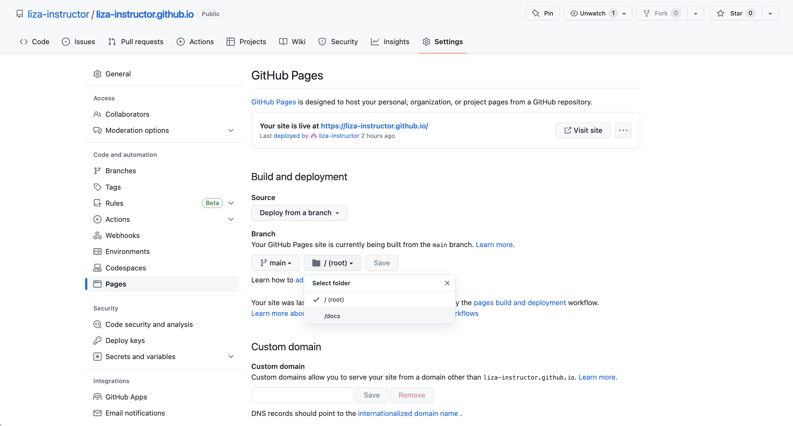

# Basic webpage ingredients

In this section we are going to go over how to turn our directory into one that is ready to be rendered with GitHub Pages. To do this, we need to do a few things:

1. Create an index.Rmd  
2. Create a YAML for the whole site  
3. Set up Pages setting in GitHub
4. (Optional) Themes and styles  

## 1. Create index.Rmd  

This index.Rmd is a location in the directory that Rmarkdown wants to point to as the 'Home' or splash page of the site. This index.Rmd is just like any other R Markdown file, but when the website builds, the build knows to associate the index.Rmd (and index.html) with your home or 'title' page. We'll see that in just a moment.  

Just like with any other R Markdown, go to **File > New File > R Markdown**, enter in whatever text you would like as your home page, then save it as 'index.Rmd'.  

## 2. Site YAML

We learned about YAMLs when we talked about Rmds: Every Rmd has a YAML that helps guide the knitting process, providing document metadata and knitting architecture. For our website, we are going to make a site YAML on our own, which will be a standalone file. This provides the _site_ with metadata and knitting architecture. 

To create a site YAML, **File > New file > Text File**, which should open up a plain text file. Then we want to save this with the exact name: '_site.yml'. The .yml extension makes this a YAML file for the site.  

Inside this site YAML we are going to add some information: 1) the name and navigation bar and 2) the output directory. First, the name is what appears on the 'tab' when you open the site, then the title and text on the navigation bar (navbar) are what will top your site. **Note: Spaces matter here!** Start by copying and pasting this text to make sure you've got it right, then edit from there. Note that we are adding the _.html_ of our files as our href pointer. An href is how we identify the target to link to in website building. It is what will become a part of the URL, when all is said and done. So also bear in mind for what you name your files. Even if you hide that name using the 'text' part of the yaml, the HTML file name will still be in your URL! 

```
name: "Liza's website"
navbar:
  title: "Liza Wood"
  left:
    - text: "About"
      href: about.html
    - text: "Research"
      href: research.html
```

Second, below this first section, we are going to space down to add another argument to specify the output directory. Notice that right now, because we've just been knitting our Rmd in no fancy way, the .Rmd and .html files are side by side in our main directory. That can get messy, so instead we want to specify a place where the .html versions of the pages go when they knit. First, let's manually make that destination by creating a new folder in your directory called 'docs'. Once we have that folder, we can specify this as the output directory of our knitted files by entering the following within the YAML with the following line:

```
output_dir: 'docs'
```

## 3. Set up GitHub Pages setting  

We're almost there! Let's navigate to the GitHub repository of this site, then to the **Settings** of the repository. Then on the left hand, navigate to **Pages**. In the Pages Settings there is a section for Build and deployment. As a default, GitHut 'deploys' the website from the main branch and root directory. BUT, we want GitHub to deploy from a different directory on the main branch, **the docs directory**. So drop down the options where 'root' is selected, and switch that to 'docs'. Notice that docs is your only option. As far as I understand, this is a standard directory name for outputs that GitHub Pages can easily point to -- this is why we named out directory 'docs'.  

```{r , echo=FALSE, out.width = '100%', fig.align='center'}

```

## 4. Rendering  

Now, we're all set. The last thing we need to do it **render the site**, so that it all knits at once, and then add, commit, and push that rendered site up to GitHub for hosting. First to render the site, we're going to use the following function _in the Console_:

```
rmarkdown::render_site()
```
You'll be able to see from the output what is happening. Each page is rendered (knit) and a new output is created, the HTML version of each R Markdown, stored in the docs/ directory. Once everything is up-to-date, you can **switch over the Terminal** and follow our git instructions:

```
git add .
git commit -m 'rendering site for first time'
git push
```

Now you may need to give it a few seconds, but now your site is live! You can navigate to your site by again entering your GitHub repository **Settings > Pages** and then you'll notice a link to 'Visit site'. That should route you to the following site https://USERNAME.github.io/.

If you see your site live, then you've done it! And you have all of the foundational tools to continue to build out your site. 

## Themes, styles, bells, whistles  

### HTML

### CSS
