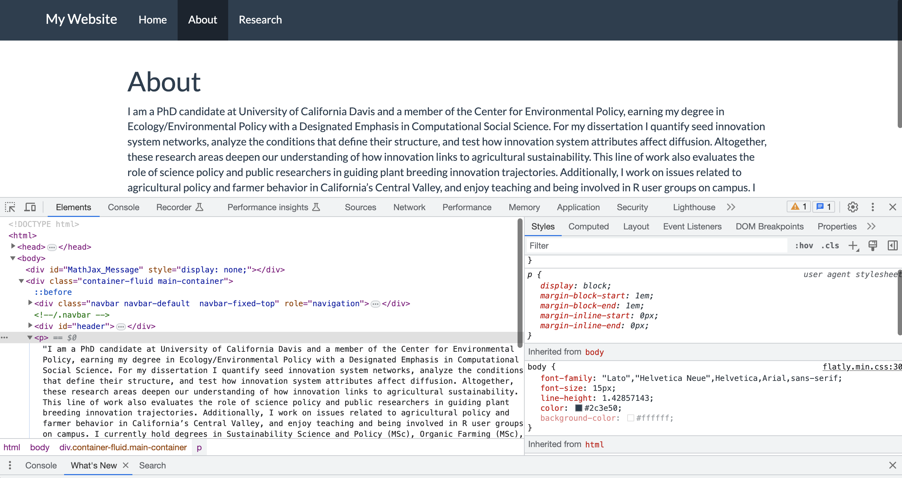

# Basic webpage ingredients

In this section we are going to go over how to turn our directory into one that is ready to be rendered with GitHub Pages. To do this, we need to do a few things:

1.  Create an index.Rmd  
2.  Create a YAML for the whole site  
3.  Set up Pages setting in GitHub  
4.  (Optional) Themes and styles  

## Create index.Rmd

The index.Rmd is a file in your R Project directory that your Rmarkdown website wants to point to as the 'Home' or splash page of the site. This index.Rmd is just like any other R Markdown file, but when the website builds, the build knows to associate the index.Rmd (and index.html) with your home or 'title' page. We'll see that in just a moment.

Just like with any other R Markdown, go to **File \> New File \> R Markdown**, enter in whatever text you would like as your home page, then save it as 'index.Rmd'.

## Site YAML

We learned about YAMLs when we talked about Rmds: Every Rmd has a YAML that helps guide the knitting process, providing document metadata and knitting architecture. For our website, we are going to make a site YAML on our own, which will be a standalone file. This provides the *site* with metadata and knitting architecture.

To create a site YAML, **File \> New file \> Text File**, which should open up a plain text file. Then we want to save this with the exact name: '\_site.yml'. The .yml extension makes this a YAML file for the site.

Inside this site YAML we are going to add some information: 1) the name and navigation bar and 2) the output directory.  

First, the name is what appears on the 'tab' when you open the site, then the title and text on the navigation bar (navbar) are what will top your site. **Note: Spaces matter here!** Start by copying and pasting this text below to make sure you've got it right, then edit from there. Note that we are adding the *.html* of our files as our href pointer. An href is how we identify the target to link to in website building. It is what will become a part of the URL, when all is said and done. So also bear in mind for what you name your files. Even if you hide that name using the 'text' part of the YAML, the HTML file name will still be in your URL!

```         
name: "Liza's website"
navbar:
  title: "Liza Wood"
  left:
    - text: "Home"
      href: index.html 
    - text: "About"
      href: about.html
    - text: "Research"
      href: research.html
```

Second, below this first section, we are going to space down to add another argument to specify the output directory. Notice that right now, because we've just been knitting our Rmd in no fancy way, the .Rmd and .html files are side by side in our main directory. That can get messy, so instead we want to specify a place where the .html versions of the pages go when they knit. First, let's **manually make that destination by creating a new folder in your directory called 'docs'.** Once we have that folder, we can specify this as the output directory of our knitted files by entering the following within the YAML with the following line:

```         
output_dir: 'docs'
```

## Set up GitHub Pages setting

We're almost there! Let's navigate to the GitHub repository of this site, then to the **Settings** of the repository. Then on the left hand, navigate to **Pages**. In the Pages Settings there is a section for Build and deployment. As a default, GitHut 'deploys' the website from the main branch and root directory. BUT, we want GitHub to deploy from a different directory on the main branch, **the docs directory**. So drop down the options where 'root' is selected, and switch that to 'docs'. Notice that docs is your only option. As far as I understand, this is a standard directory name for outputs that GitHub Pages can easily point to -- this is why we named out directory 'docs'.

```{r , echo=FALSE, out.width = '100%', fig.align='center'}
knitr::include_graphics("imgs/change_docs.png")
```

## Rendering

Now, we're all set. The last thing we need to do it **render the site**, so that it all knits at once, and then add, commit, and push that rendered site up to GitHub for hosting. First to render the site, we're going to use the following function **in the Console**:

```         
rmarkdown::render_site()
```

You'll be able to see from the output what is happening. Each page is rendered (knit) and a new output is created, the HTML version of each R Markdown, stored in the docs/ directory. Once everything is up-to-date, you can **switch over the Terminal** and follow our git instructions:

```         
git add .
git commit -m 'rendering site for first time'
git push
```

Now you may need to give it a few seconds, but now your site is live! You can navigate to your site by again entering your GitHub repository **Settings \> Pages** and then you'll notice a link to 'Visit site'. That should route you to the following site <https://USERNAME.github.io/>.

If you see your site live, then you've done it! And you have all of the foundational tools to continue to build out your site.

## Themes, styles, bells, whistles

So far we've built a bare-bones website. With markdown tools alone, you can create a fairly complex architecture -- different pages, tabs and links within those pages, embedding images, PDFs, videos. At this point, the quality of your webpage will be more about your content and creativity. But of course, we may want to add in some different fonts, colors, and styles. There are several approaches for this.  

### Themes

One of the easiest ways to modify the style of your page is to take one of the pre-built R Markdown themes. You can check out the [R Markdown Theme Gallery](https://www.datadreaming.org/post/r-markdown-theme-gallery/) to get a sense of what these look like. Mostly they change the fonts and some coloration styles.

You can try out different themes by adding a couple lines into your site YAML, below what you already have. For example, you can try out the 'flatly' theme by specifying that in the following text:

```         
output:
  html_document:
    theme: flatly
```

Now, themes are a great starting point, but you may want to customize more. The next sections talk about custom styling.

### Global styling with CSS

Themes only get you so far, and so one of the next big jumps is into the world of CSS styling. A popular way to customize your page styles is with a 'styles.css' file. CSS (Cascading Style Sheets) is used to style and layout web pages — for example, to alter the font, color, size, and spacing of your content, split it into multiple columns, or add animations and other decorative features.

To set up this global styling, we need to do a couple things 1. create the file, 2., fill it with CSS style specifications, and 3. signal to our site YAML that we want to use it. 

First, let's create the file. We can do this the same way we made the .yml, which is to open a plain text file (**File > New File > Text File**). This just generally makes sense for creating special file extensions that aren't pre-specified in R Studio. Once you have that text file, save it as styles.css.  

Next, we need to fill in our file with CSS styles. Now, this is not an easy task. CSS builds on knowledge of HTML, which we are not writing ourselves for this workshop. I am going to point us to a few CSS tutorials that can help us wrap our head around this.  

* [Fairly deep explanation of CSS and its relationship to HTML](https://developer.mozilla.org/en-US/docs/Learn/CSS)   
* [Appendix that intros CSS](https://bookdown.org/yihui/blogdown/website-basics.html)  
* [Working tutorial for CSS](https://www.w3schools.com/css/css_selectors.asp)  


But, the general intuition of CSS is that it calls on different _selectors_ that match with the HTML formatting, then specifies the _properties_ of how we would like to style that selector. For instance, the HTML of a page may look something like this:

```
<h1>Home<\h1>
<p>This is my home page<\p>
```

The HTML here is signalling that there is a title (h1 or header 1) and text (p). These are the _element selectors_ that we can cue in on. We can then specify different _properties_ like color, hover, size, font-family, font-size, text-align, background-color,

```
h1 {
  text-align: center
}
p {
  color: #702963  
}
```

We can also call on _class selectors_ rather than specific element selectors. So while 'p' is an element in our HTML, something like .navbar is a class. Classes tend to start with a period, and are based on some shared formatting feature. For example .navbar represents the navigation bar element, and .highlight represents any text that has been highlighted. We could add paddings around the navigation bar as follows:

```
.navbar {
  padding-bottom: 1em;
  padding-top: 1em;
  background-color: #FFFFFF
}

```

Last, we have to signal to our site that it should use the style.css file to style our site. We can do this by adding yet another line to your _site.yml. As part of output, we want to add on..

```
output:
  html_document:
    theme: flatly
    css: styles.css
```

Now let's run through the last steps to see our rendered site again.

In the Console:
```
rmarkdown::render_site()
```

In the Terminal:
```
git add .
git commit -m 'adding CSS'
git push
```

### In-line styling with HTML or CSS  

It is worth noting that you can also add some custom styling per page, rather than globally. So while you may want your text to generally be black, you could change the text of one page to be green by putting CSS code in-line in a certain R Markdown page. For example, in your about R Markdown, you could add: 

```
\```{css, echo=FALSE}
p {
  color: #070
}
\```
```

#### More on CSS   

There is a lot to toggle around here, and I am not a CSS expert. I like the recommendation of the Bookdown appendix that recommends you to **use your Developer Tools of your browser.** You can use these to really look at the underlying HTML, and the associated CSS styling of any webpage, including your own! Let's take a look at my most recent version of my webpage (Note you need to look at it _rendered_, not just the HTML local to your computer).

```{r , echo=FALSE, out.width = '100%', fig.align='center'}

```

Here we can see the HTML on the left of the Develop Tools screen, and on the right it reveals the CSS styling. It is a big complicated to navigate, but we can see the different elements and their properties. If you aren't sure where to start, you can take a look at the style already embedded in your site, then modify it. 

Another useful way of learning CSS is to find sites you like, look at their sites via Developer Tools, and perhaps even go find their CSS styling code, if available like on GitHub. Similarly, there as [CSS templates](https://www.w3schools.com/css/css_templates.asp) out there. Because it is another language, it will inevitably take some time to get used to, but don't be discouraged!  